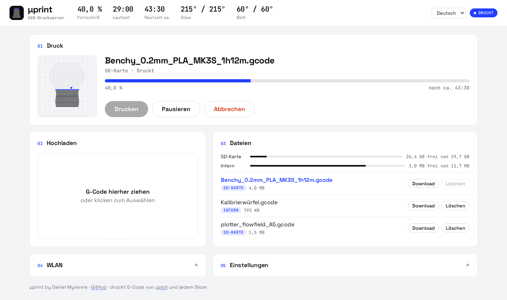

# μprint

μprint macht aus einem ESP32-S3 einen Druckserver für 3D-Drucker mit Marlin- oder Prusa-Firmware.
G-Code lädst du im Browser hoch. μprint speichert ihn auf einer microSD-Karte oder im internen Speicher und schickt
ihn über USB an den Drucker. Starten, Pausieren und Abbrechen gehen über die Weboberfläche, ein PC muss nicht laufen.

## Installation

Du brauchst:

- ein ESP32-S3-Board mit 16 MB Flash und 8 MB PSRAM (Variante **N16R8**)
- einen USB-OTG-Adapter für die USB-Buchse des Boards, an die später der Drucker kommt
- ein 5-V-Netzteil für das Board
- optional ein microSD-Modul (MOSI 11, MISO 13, SCLK 12, CS 10)

Firmware aufspielen:

1. [dmyrenne.github.io/uprint](https://dmyrenne.github.io/uprint/) in Chrome oder Edge öffnen.
2. Das Board per USB an den Computer anschließen und auf **Installieren** klicken.

Ohne Browser geht es mit [esptool](https://docs.espressif.com/projects/esptool/) und der Datei
`uprint-…-factory.bin` von den [Releases](https://github.com/dmyrenne/uprint/releases):

    esptool --chip esp32s3 write-flash 0x0 uprint-…-factory.bin

## Ersteinrichtung

1. Mit dem WLAN **uprint** verbinden (Passwort `uprint123`) und http://192.168.4.1 öffnen.
2. Unter **WLAN** das eigene Netz wählen und verbinden. Danach ist μprint unter http://uprint.local erreichbar.
3. Den Drucker per USB an das Board anschließen. Der Status oben rechts wird blau, sobald er verbunden ist.

Kommt keine Verbindung zum Drucker zustande, liefert die USB-Buchse vermutlich keine 5 V. Bei vielen Boards muss dafür
eine Lötbrücke geschlossen werden, oft mit `USB-OTG` beschriftet.

## Update

Die Datei `uprint-…-ota.bin` von den [Releases](https://github.com/dmyrenne/uprint/releases) laden und in μprint unter
**Einstellungen → Firmware** installieren. Einstellungen und Dateien bleiben erhalten.
